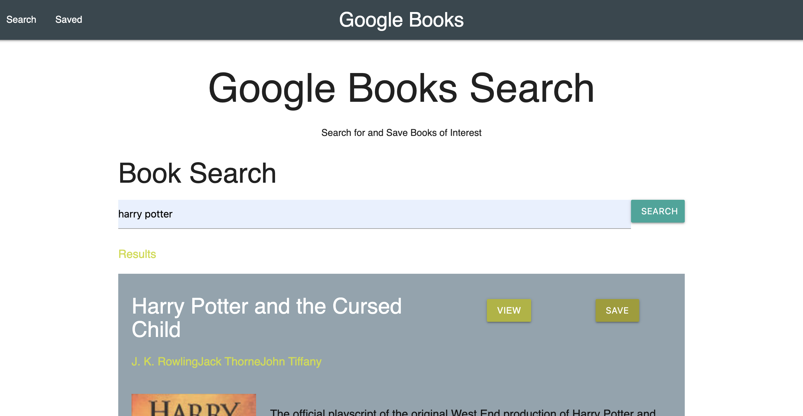

# Google Books Search App


## Description  
Full MERN stack application. Google Books Search Application that allows to search books uisng the [Google Books API](https://developers.google.com/books) and save books to review or purchase later with the implementation of [MongoDB](https://www.mongodb.com/) database. The site is hosted on [Heroku](https://www.heroku.com/).



    
## Table of Contents   
* [User Story](#User-Story)
* [Acceptance Criteria](#Acceptance-Criteria)
* [Installation](#Installation)
* [Usage](#Usage)
* [Credits](#Credits)
* [License](#License)
* [Questions](#Questions)

## User Story

* As a user, I want to be able to search books. I should also be able to save books to review or purchase later.

## Acceptance Criteria

```
GIVEN a Google Books Application
WHEN I open the Google Books App
THEN I am presented with a welcome page with a searchbar
WHEN I enter the title of a book and click on the search button
THEN I am presented with a list of books
WHEN I click on the `View` button
THEN a new tab linked to the selected book opens up
WHEN I click on the `Save` button
THEN the book is saved into the database
WHEN I click on the `Saved` button
THEN I am presented with a list of saved books from database
WHEN I click on the `Remove` button
THEN the book is removed from the database

```

## Installation
1. Clone the repo.
2. Navigate to the project directory.
3. Run command ```npm install``` to install any dependencies.

## Usage    
* Navigate to [Google Books Site](https://safe-brushlands-83876.herokuapp.com/).
* Enter the name of a book on the searchbar.
* Click on the search button.
* Click on View button to check a book.
* Click on Save button to save books to review or purchase later.
* Click on Saved button to check a list of saved books.
* Click on Remove button to remove a book from the list.

## Credits  
Developed by: 
Manuel Leung Chen ([GitHub](https://github.com/manuelleungchen))

Tools used to Develop this MERN stack application: 

* [MongoDB](https://www.mongodb.com/3)
* [Express.js](https://www.npmjs.com/package/express)
* [React.js](https://reactjs.org/)
* [Node.js](https://nodejs.org/en/)
* [Materialize](https://materializecss.com/)
* [Mongoose](https://www.npmjs.com/package/mongoose)
* [Google Books API](https://developers.google.com/books)
* [Heroku](https://www.heroku.com/)

## License
Copyright (c) 2020 - Manuel Leung Chen

Licensed under the [MIT License](https://choosealicense.com/licenses/mit/).
 

## Questions
Manuel Leung Chen - [GitHub](https://github.com/manuelleungchen )

If you have any question about this application, please reach out me by [Email](manuel.leungchen@gmail.com)

